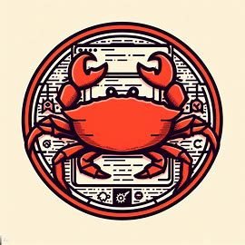

# rust-micro-cms

	
Contents

	<ol>
		<li>
			<a href="#purpose">Purpose</a>
		</li>
		<li>
			<a href="#about-this-project">About this Project</a>
			<ul>
				<li><a href="#goals">Goals</a></li>
			</ul>
		</li>
		<li><a href="#roadmap">Roadmap</a></li>
		<li><a href="#contributing">Contributing</a></li>
	</ol>

## About this Project

This project's purpose is to create an easily deployable website CMS, with a complete backend and frontend, ultimately with a "What you see is what you get" (WYSIWYG) or similar input for ease of posting.

### Goals

Ultimately this project is a learning project, to help understand how Rust can be used (and possibly not used). But the goal for this project is create a rich content management system that someone could simply add the binaries to their desired server environment and then access and configure their installation, much like WordPress or other popular content management systems, through a browser client. 

The project is meant to have a small footprint, and hopefully offer a more reliable and secure CMS solution, with less overall logic and complexity.

## Roadmap:
Frontend Development

- [x] Browser-based input for new posts
	- [ ] Design and implement a user-friendly interface for creating new posts.
	- [ ] Ensure compatibility across different browsers and devices.
- [ ] Update and delete posts through browser
	Implement functionality to edit and delete existing posts.
	Include safeguards to prevent accidental deletion.
- [ ] Add media to posts
	Develop a system for uploading and embedding media (images, videos, etc.) in posts.
	Ensure media is displayed correctly across different browsers and devices.

Backend Development

- [ ] Backend built with Rust using Axum
	Design and implement a robust backend system to handle requests from the frontend.
	Ensure the backend is secure and can handle high traffic.

Database Management System

- [ ] Database Management System
	Choose an appropriate DBMS for the project (considering factors like scalability, performance, etc.).
	Design the database schema and set up the database.
	Implement functionality for basic CRUD (Create, Read, Update, Delete) operations.

User Authentication

- [ ] Login/Verification System
	Implement a secure login system for users.
	Include features like password recovery, email verification, etc.

SEO Optimization

- [ ] SEO Optimization
	Implement SEO best practices to improve the visibility of the CMS on search engines.

Accessibility

- [ ] Accessibility
	Ensure that the CMS is accessible to all users, including those with disabilities.

Testing & Deployment

- [ ] Testing
	Perform unit testing to ensure individual components of the project are working as expected.
	Conduct integration testing to ensure all parts of the project work together seamlessly.
- [ ] Deployment
	Set up a server environment for deploying the CMS.
	Ensure the CMS is easily deployable, similar to WordPress or other popular CMSs.

Documentation & Community

- [ ] Documentation
	Write comprehensive documentation covering all aspects of the CMS, including setup, usage, troubleshooting, etc.
- - [ ] Community
	Encourage community involvement through contributions, feedback, etc.

### Contributing

If you want to contribute to this project that is great! I am doing this to learn Rust and welcome anyone else doing the same or anyone that thinks a solution like this is something they would like to see happen!

[<a href="#readme-top">RETURN TO TOP</a>]

