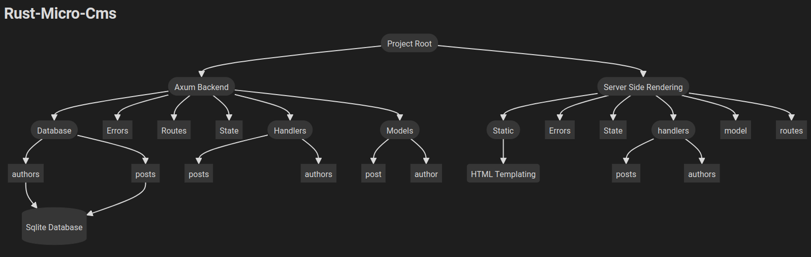

# Rust Micro CMS Backend

<div align="center">
  
</div>

<div align="center">
  
</div>

<details>
  <summary>Contents</summary>
  <ol>
    <li><a href="#about-this-backend">About This Backend</a></li>
    <li><a href="#installation">Installation</a></li>
    <li><a href="#running">Running</a></li>
    <li><a href="#contributing">Contributing</a></li>
  </ol>
</details>

## About This Backend

Rust Micro CMS Backend is designed as a robust foundation for the Rust Micro CMS, facilitating efficient data management and providing a RESTful API interface. It uses SQLx with SQLite to offer a performant, asynchronous interface to a file-based database, making database operations seamless and swift. This backend caters to the architectural needs of modern web applications by offering scalability, ease of deployment, and integrated security measures.

## Installation

To set up the Rust Micro CMS Backend, follow these steps to prepare your environment:

### Prerequisites

- **Rust and Cargo:** Ensure you have Rust and Cargo installed. They are essential for building and managing dependencies.
  - Installation guide: [Official Rust Installation](https://www.rust-lang.org/tools/install).

- **SQLite3:** This project uses SQLite, a lightweight file-based database. Ensure SQLite3 is installed on your system.
  - For installation details, see [SQLite Download Page](https://www.sqlite.org/download.html).

- **SQLx CLI:** SQLx is used for compile-time checked SQL queries which enhance reliability and maintenance.
  ```bash
  cargo install sqlx-cli --no-default-features --features native-tls,sqlite
  ```

### Environment Setup

1. **Clone the Repository:**
   ```bash
   git clone https://github.com/your-username/rust-micro-cms-backend.git
   cd rust-micro-cms-backend
   ```

2. **Set Up Environment Variables:**
   Copy the `.env.example` to `.env` and modify it to suit your configuration.
   ```plaintext
   DATABASE_URL=sqlite:./path/to/your/database.db
   ```

3. **Database Initialization:**
   Initialize the database and run migrations.
   ```bash
   sqlx database create
   sqlx migrate run
   ```

## Running

To run the backend server:

```bash
cargo run
```

This command starts the server which listens for API requests. You can interact with the backend using the defined RESTful endpoints through tools like cURL or Postman.

## Contributing

Contributions to the Rust Micro CMS Backend are welcomed. Whether it's adding new features, fixing bugs, or improving documentation, your help is appreciated.

1. **Fork the Project:**
   Start by forking the repository on GitHub.

2. **Create Your Feature Branch:**
   ```bash
   git checkout -b feature/AmazingFeature
   ```

3. **Commit Your Changes:**
   ```bash
   git commit -m 'Add some AmazingFeature'
   ```

4. **Push to the Branch:**
   ```bash
   git push origin feature/AmazingFeature
   ```

5. **Open a Pull Request:**
   Go to the original repository and open a pull request with a comprehensive description of the changes.

For more detailed instructions on setting up the development environment and contributing, refer to the main project documentation.

<p align="center">[<a href="#readme-top">RETURN TO TOP</a>]</p>